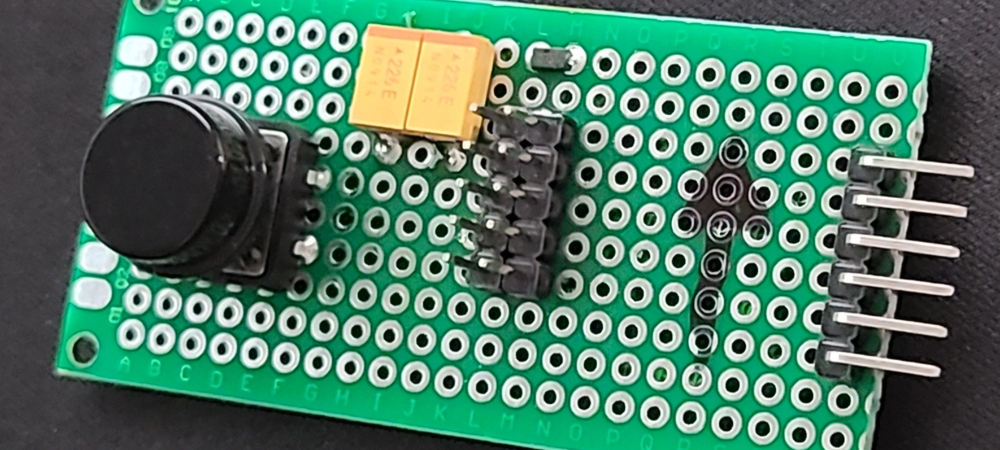
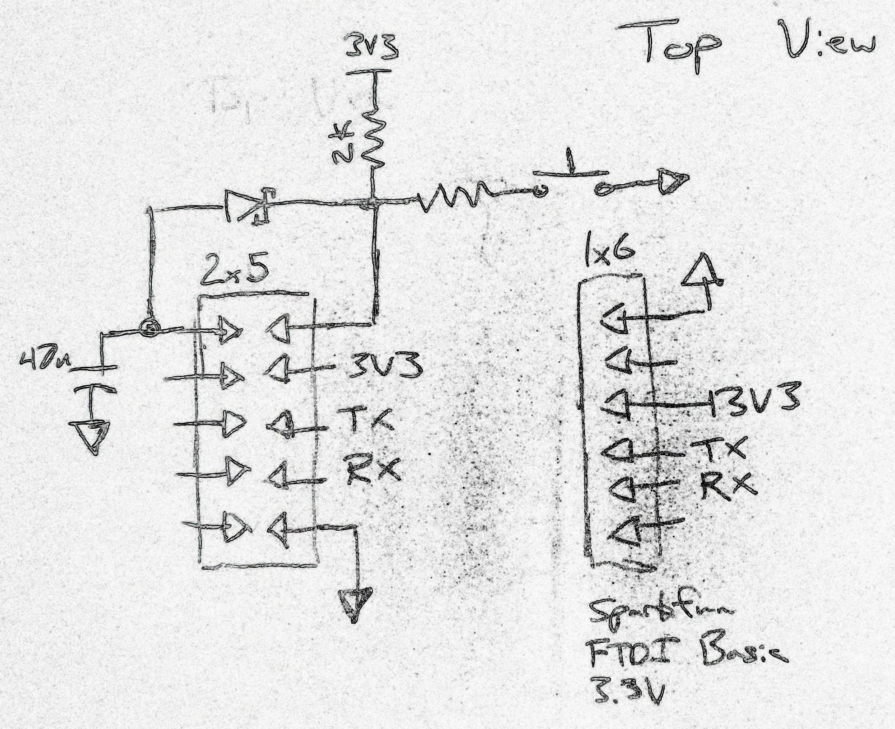

# XVA_TouchStack
 
You will need a copy of Simplicity Studio to edit and compile the firmware.
To upload using the bootloader use hex2boot and efm8load utilities from the following repository
https://github.com/mschuldt/_efm8

To put the device into bootloader mode, connect pin 1 and 10 on the header and short them to ground. Disconnect pin 10 and the device
will be ready to program.

You might want to add a current limiting resistor to prevent damage to the switch contacts.

